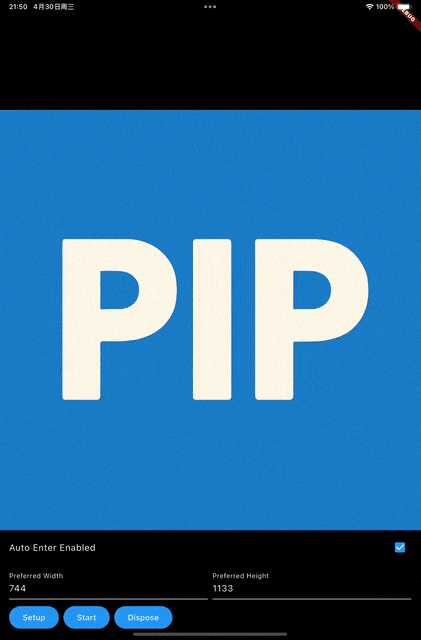

# Flutter PiP Plugin Usage Guide

## Introduction
pip is a Flutter plugin that supports Picture in Picture (PiP) functionality for both Android and iOS. It allows applications to continue displaying content in a small window while in the background.

## Preview



Android is too simple to show, so I will not show it here.

## Installation
Add the dependency in your `pubspec.yaml`:
```yaml
dependencies:
  pip: ^latest_version
```

## Platform Specific Setup  

### Android

Add the following permission to your `AndroidManifest.xml`:

```xml
<activity android:name="VideoActivity"
    android:supportsPictureInPicture="true"
    android:configChanges=
        "screenSize|smallestScreenSize|screenLayout|orientation"
    ...
```

## Basic Usage

```dart
import 'package:pip/pip.dart';

final _pip = Pip();
```

### 1. Initialization and Feature Check
```dart
// Check if device supports PiP
bool isPipSupported = await _pip.isSupported();

// Check if auto-enter PiP mode is supported
bool isPipAutoEnterSupported = await _pip.isAutoEnterSupported();

// Check if currently in PiP mode
bool isPipActived = await _pip.isActived();
```

### 2. PiP Configuration
```dart
final options = PipOptions(
  autoEnterEnabled: true,      // Enable/disable auto-enter PiP mode
  // Android specific options
  aspectRatioX: 16,           // Aspect ratio X value
  aspectRatioY: 9,            // Aspect ratio Y value
  sourceRectHintLeft: 0,      // Source rectangle left position
  sourceRectHintTop: 0,       // Source rectangle top position
  sourceRectHintRight: 1080,  // Source rectangle right position
  sourceRectHintBottom: 720,  // Source rectangle bottom position
  // iOS specific options
  sourceContentView: 0,        // Source content view
  contentView: 0,             // Content view to be displayed in PiP
  preferredContentWidth: 480,  // Preferred content width
  preferredContentHeight: 270, // Preferred content height
  controlStyle: 2,            // Control style for PiP window
);

await _pip.setup(options);
```

### 3. PiP State Monitoring
```dart
await _pip.registerStateChangedObserver(
  PipStateChangedObserver(
    onPipStateChanged: (state, error) {
      switch (state) {
        case PipState.pipStateStarted:
          print('PiP started successfully');
          break;
        case PipState.pipStateStopped:
          print('PiP stopped');
          break;
        case PipState.pipStateFailed:
          print('PiP failed: $error');
          break;
      }
    },
  )
);
```

### 4. PiP Lifecycle Management
```dart
// Start PiP mode
await _pip.start();

// Stop PiP mode
await _pip.stop();

// Release PiP resources
await _pip.dispose();
```

## API Reference

### PipOptions
```dart
PipOptions({
  bool? autoEnterEnabled,      // Enable/disable auto-enter PiP mode
  // Android specific options
  int? aspectRatioX,          // Aspect ratio X value
  int? aspectRatioY,          // Aspect ratio Y value
  int? sourceRectHintLeft,    // Source rectangle left position
  int? sourceRectHintTop,     // Source rectangle top position
  int? sourceRectHintRight,   // Source rectangle right position
  int? sourceRectHintBottom,  // Source rectangle bottom position
  // iOS specific options
  int? sourceContentView,      // Source content view
  int? contentView,           // Content view to be displayed in PiP
  int? preferredContentWidth, // Preferred content width
  int? preferredContentHeight,// Preferred content height
  int? controlStyle,          // Control style for PiP window
                              // 0: default show all system controls
                              // 1: hide forward and backward button
                              // 2: hide play pause button and the progress bar including forward and backward button (recommended)
                              // 3: hide all system controls including the close and restore button
})
```

### PiP States
```dart
enum PipState {
  pipStateStarted,  // PiP mode is active
  pipStateStopped,  // PiP mode is stopped
  pipStateFailed    // PiP operation failed
}
```

### Core Methods

#### Check PiP Support
```dart
// Check basic PiP support
Future<bool> isSupported()

// Check auto-enter PiP support
Future<bool> isAutoEnterSupported()

// Check if PiP is currently active
Future<bool> isActived()
```

#### PiP Lifecycle Management
```dart
// Setup or update PiP configuration
Future<bool> setup(PipOptions options)

// Start PiP mode
Future<bool> start()

// Stop PiP mode
Future<void> stop()

// Clean up PiP resources
Future<void> dispose()
```

#### State Management
```dart
// Register state change observer
Future<void> registerStateChangedObserver(
  PipStateChangedObserver observer
)

// Unregister state change observer
Future<void> unregisterStateChangedObserver()
```

## Platform-Specific Considerations

### Android
- All aspect ratio and source rectangle configurations are Android-specific
- Source rectangle hints help smooth transitions into PiP mode
- `pipStop()` operation only switches the app to background
- Ensure necessary permissions are declared in the app

### iOS
- Content view and dimension settings are iOS-specific
- Call `pipStart()` when the app enters background (`AppLifecycleState.inactive`)
- Call `pipStop()` when the app returns to foreground (`AppLifecycleState.resumed`)
- Recommended to use `autoEnterEnabled` for automatic PiP mode entry
- The `contentView` will be added to the PiP view after setup, and you are responsible for rendering the content view
- Choose appropriate `controlStyle` based on your needs:
  - Style 0: Shows all system controls (default)
  - Style 1: Hides forward and backward buttons
  - Style 2: Hides play/pause button and progress bar (recommended)
  - Style 3: Hides all system controls including close and restore buttons
- How to set the size of the PiP window? Just set the `preferredContentWidth` and `preferredContentHeight` in the `PipOptions`

## Best Practices

1. **Platform-Specific Configuration**
```dart
if (Platform.isAndroid) {
  options = PipOptions(
    autoEnterEnabled: true,
    aspectRatioX: 16,
    aspectRatioY: 9,
  );
} else if (Platform.isIOS) {
  options = PipOptions(
    autoEnterEnabled: true,
    contentView: someView,
    sourceContentView: someOtherView,
    preferredContentWidth: 480,
    preferredContentHeight: 270,
    controlStyle: 2,
  );
}
```

2. **Proper Resource Management**
```dart
@override
void dispose() {
  _pip.unregisterStateChangedObserver();
  _pip.dispose();
  super.dispose();
}
```

3. **Error Handling**
```dart
try {
  await _pip.start();
} catch (e) {
  print('Error starting PiP: $e');
}
```

## Common Issues

1. **PiP Won't Start**
   - Verify device supports PiP
   - Confirm PiP parameters are set correctly
   - Check error callback messages

2. **Auto-Enter Mode Not Working**
   - Confirm device supports auto-enter functionality
   - Verify `autoEnterEnabled` setting

3. **PiP Window Ratio Issues**
   - Ensure correct aspect ratio settings
   - Be aware of platform-specific limitations

## Tips for Implementation
1. Always check device compatibility before enabling PiP features
2. Implement proper error handling for better user experience
3. Consider platform differences when implementing PiP functionality
4. Test thoroughly on both Android and iOS devices
5. Handle app lifecycle changes appropriately